## Simple Blog API (FastAPI)

Небольшой асинхронный REST API для блога. Данные хранятся в памяти и автоматически сохраняются/загружаются из `data/*.json`.

### Запуск

```bash
python3 -m venv .venv
source .venv/bin/activate
pip install -r requirements.txt
uvicorn app.main:app --reload
```

- Swagger: `http://127.0.0.1:8000/docs`
- Главная страница (HTML): `http://127.0.0.1:8000/`

### Что есть
- CRUD для пользователей и постов (async)
- Валидация входных данных (Pydantic)
- HTML-страницы: список постов, просмотр, создание, редактирование
- Автосохранение данных в JSON (опционально)

### Эндпоинты
- Users: `POST /users`, `GET /users`, `GET /users/{id}`, `PUT /users/{id}`, `DELETE /users/{id}`
- Posts: `POST /posts`, `GET /posts`, `GET /posts/{id}`, `PUT /posts/{id}`, `DELETE /posts/{id}`

### Как пользоваться
- Быстрее всего через Swagger (`/docs`): сначала создайте пользователя (`POST /users`), затем пост (`POST /posts`).
- Можно и с HTML-страниц: `/html/posts/new` (создание) и `/html/posts/{id}/edit` (редактирование).

### Примеры cURL
```bash
# Создать пользователя
curl -sS -X POST http://127.0.0.1:8000/users \
  -H 'Content-Type: application/json' \
  -d '{"email":"alice@example.com","login":"alice","password":"secret123"}'

# Создать пост (подставьте свой authorId)
curl -sS -X POST http://127.0.0.1:8000/posts \
  -H 'Content-Type: application/json' \
  -d '{"authorId":1,"title":"Hello","content":"First post"}'
```

Windows PowerShell:
```powershell
# Создать пользователя
irm http://127.0.0.1:8000/users -Method Post -ContentType "application/json" -Body '{"email":"alice@example.com","login":"alice","password":"secret123"}'

# Список пользователей
irm http://127.0.0.1:8000/users

# Создать пост
irm http://127.0.0.1:8000/posts -Method Post -ContentType "application/json" -Body '{"authorId":1,"title":"Hello","content":"First post"}'
```

### Скриншоты
Ниже — несколько кадров для проверки успешных и ошибочных сценариев (папка `screenshots/`).

- Swagger
  
  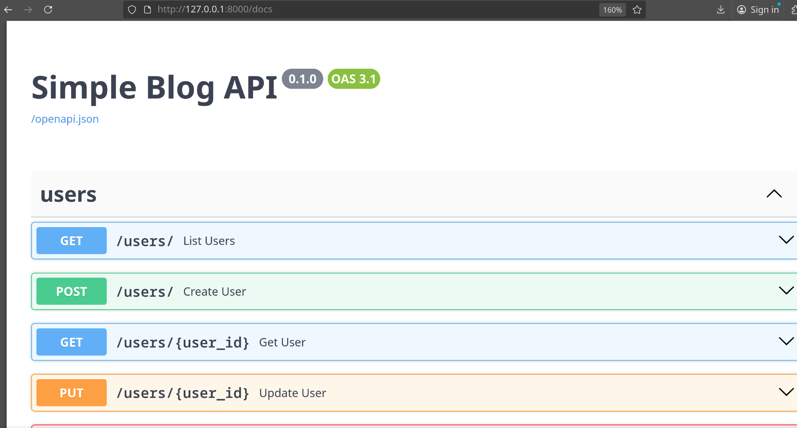

- Создание пользователя (запрос и ответ)
  
  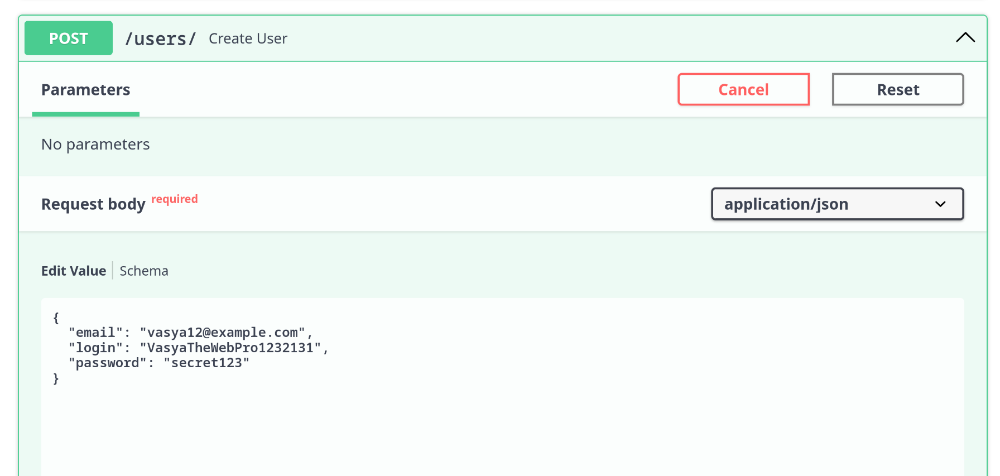
  
  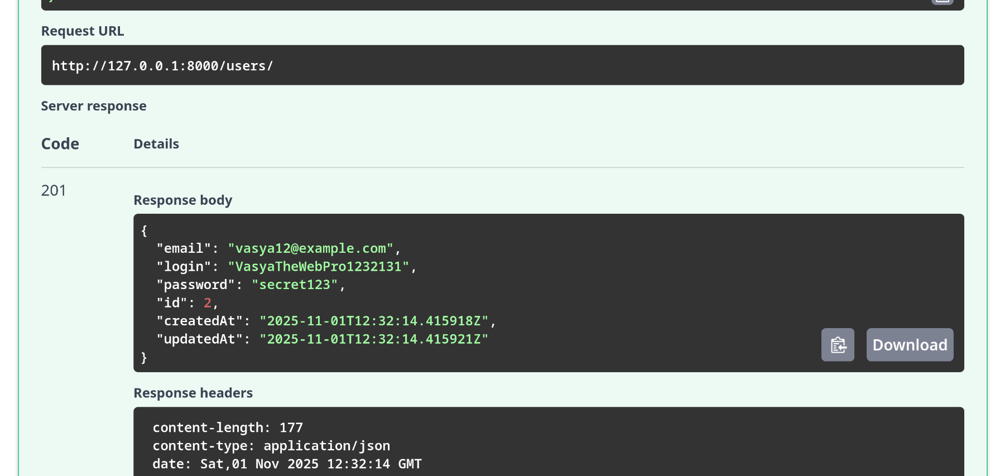

- Список пользователей (запрос и ответ)
  
  
  
  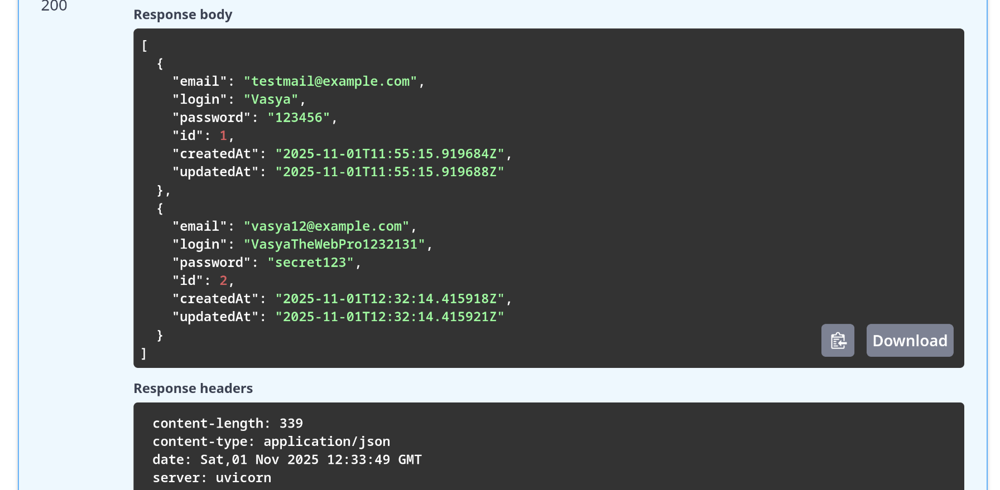

- Создание поста (запрос и ответ)
  
  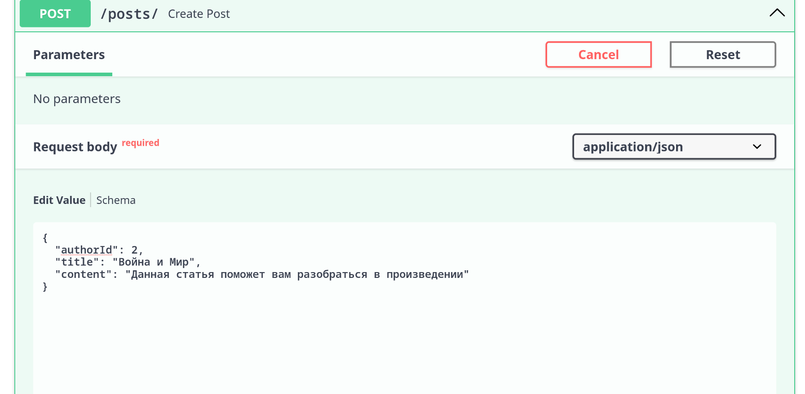
  
  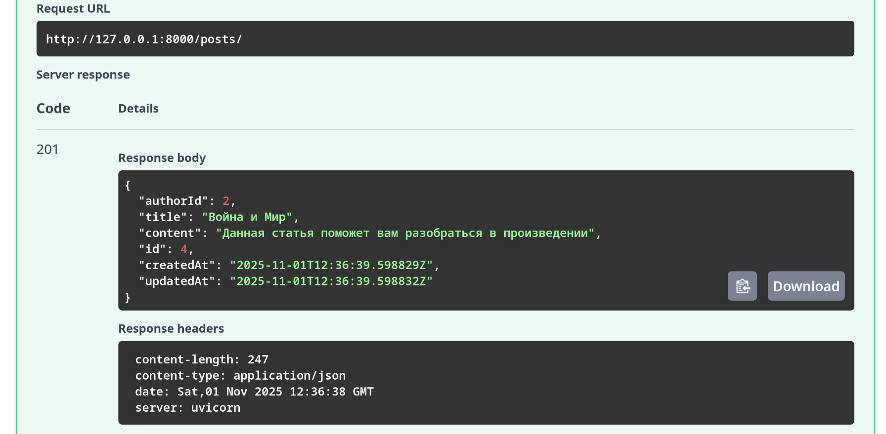

- Ошибки (дубликат пользователя, несуществующий автор)
  
  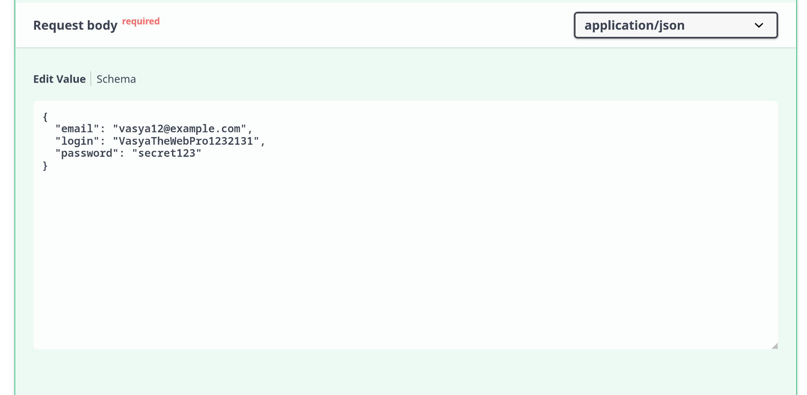
  
  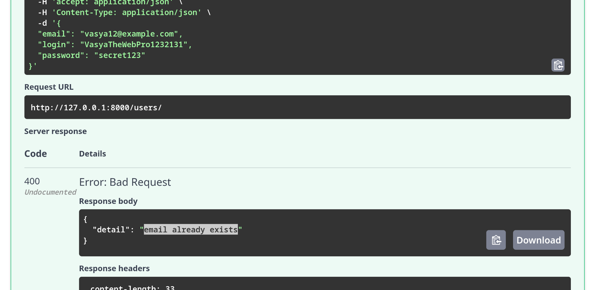
  
  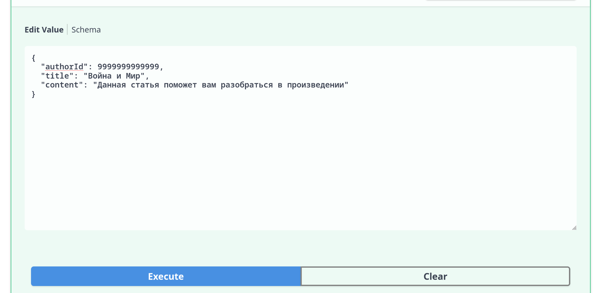
  
  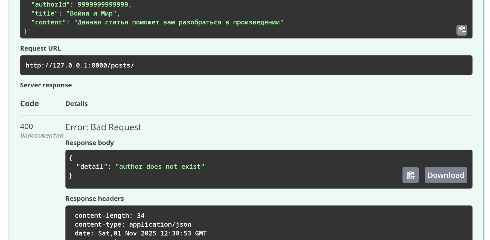

- Примеры использования - Главная HTML страница, создание блога, подтверждение создания блога 
  
  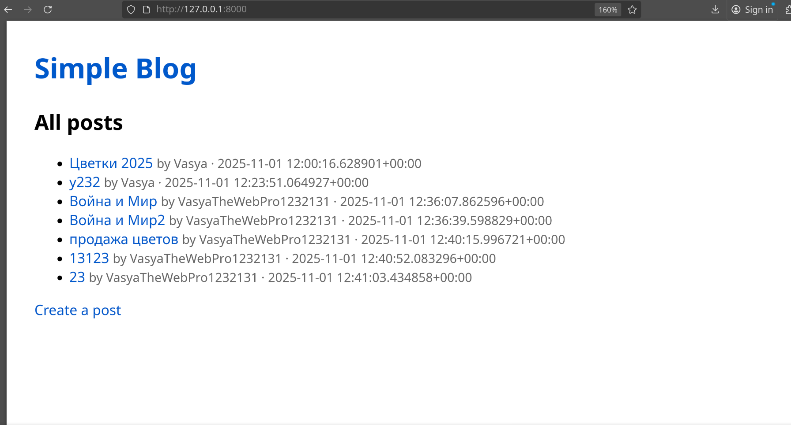
  
  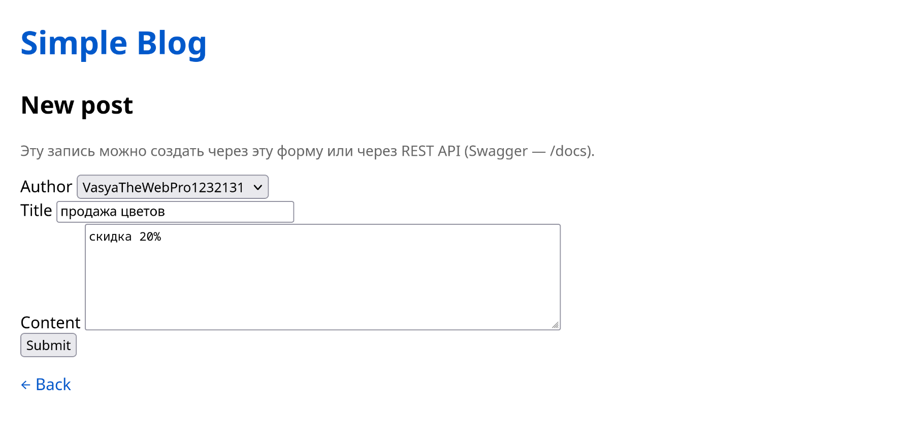
  
  
  
  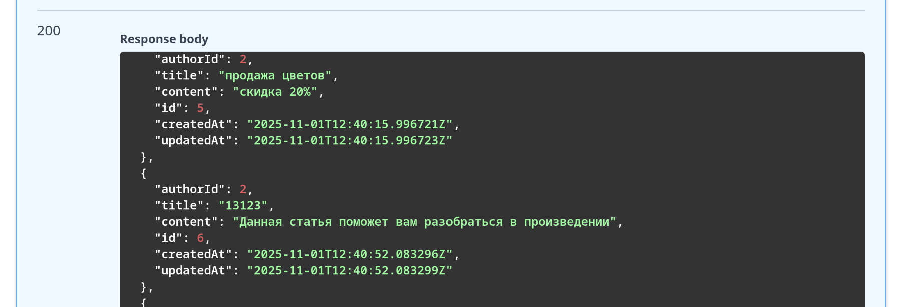

